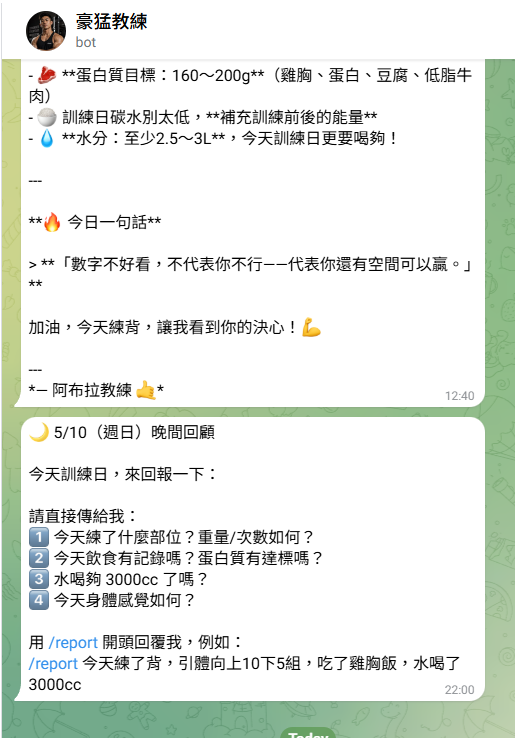

# 豪猛健身教練 🏋️

> 個人 AI 健身教練 Telegram Bot，由 Claude Sonnet 4.6 驅動，自動記錄飲食、訓練、InBody 數據到 Notion。

---

## 截圖預覽

### 每日早晨日報


---

## 功能特色

| 功能 | 說明 |
|------|------|
| 💬 健身問答 | 問動作要領、訓練建議，Claude 即時回覆 |
| 📸 食物照片分析 | 傳照片自動估算蛋白質、碳水、脂肪、熱量 |
| 📊 InBody 自動解析 | 傳量測報告照片，自動存入 Notion 身體數據 |
| 🏋️ 訓練日誌記錄 | 貼上組數格式資料，自動建立訓練紀錄與動作資料庫 |
| 🍽️ 飲食記錄 | 輸入「早餐 燕麥雞蛋」即自動存入 Notion |
| ⏰ 早晨日報 | 每天 09:00 發送今日計畫、訓練分析、飲食建議 |
| 🌙 晚間回顧 | 每天 22:00 詢問當日達成狀況 |
| 🔧 Notion 工具呼叫 | Claude 可自主查詢、修改、刪除 Notion 紀錄 |

---

## 系統架構

```
用戶 (Telegram)
    ↕
Oracle Cloud VM (Ubuntu 22.04, 24/7)
    ├── bot.py          ← 主程式
    ├── morning.py      ← cron 09:00 台灣時間
    └── evening.py      ← cron 22:00 台灣時間
         ↕
Claude Sonnet 4.6 (Anthropic API)
         ↕
Notion 資料庫
    ├── 每日飲食紀錄
    ├── 每日習慣追蹤（InBody）
    ├── 每日訓練紀錄（Workout Log）
    ├── 單組紀錄（Set Log）
    └── 動作資料庫（Exercise Library）
```

---

## 快速開始

### 環境需求
- Python 3.10+
- Oracle Cloud 或任意 Linux 主機

### 安裝

```bash
git clone https://github.com/jones86723/abula-fitness-coach-bot.git
cd abula-fitness-coach-bot
pip install pyTelegramBotAPI anthropic httpx requests python-dotenv
```

### 設定環境變數

複製範本並填入你的 key：

```bash
cp .env.example .env
```

`.env` 內容：

```env
ANTHROPIC_KEY=sk-ant-api03-...
BOT_TOKEN=你的 Telegram Bot Token
NOTION_TOKEN=ntn_...
TELEGRAM_CHAT_ID=你的 Chat ID
```

### 啟動

```bash
python bot.py
```

---

## Bot 指令

| 指令 | 功能 |
|------|------|
| `/start` | 顯示功能說明 |
| `/today` | 查看今日飲食紀錄 |
| `/goal` | 查看碳循環目標 |
| `/report [內容]` | 晚間回報，存入 Notion 習慣追蹤 |

### 自動偵測（無需指令）

```
早餐 燕麥1碗 雞蛋2顆         → 存飲食記錄 + 營養分析
[InBody 照片]                → 解析數值 + 存 Notion
[食物照片]                   → 估算營養成分
[訓練組數格式資料]            → 建立訓練日誌 + 自動填訓練部位
胸肌要怎麼練？               → Claude 回答
```

### 訓練資料格式範例

```
引體向上（輔助）
組 1: 75 kg x 12
組 2: 75 kg x 12

坐式滑輪划船
"身體打直，不要借力"
組 1: 42.5 kg x 12
組 2: 42.5 kg x 12
```

Bot 會自動：
1. 解析每個動作的組數/重量/次數
2. 在動作資料庫建立新動作（含教練備注）
3. 建立單組紀錄
4. 建立今日訓練日誌並填入訓練部位

---

## 碳水循環目標

| 日類別 | 碳水 | 蛋白質 | 脂肪 | 熱量 |
|--------|------|--------|------|------|
| 低碳日 | 100g | 240g | 100g | 2260 kcal |
| 中碳日 | 250g | 200g | 60g | 2340 kcal |
| 高碳日 | 400g | 160g | 30g | 2510 kcal |

---

## 部署到 Oracle Cloud VM

```bash
# 上傳程式
scp -i ssh-key.key bot_cloud.py morning.py evening.py .env ubuntu@YOUR_IP:/home/ubuntu/

# 設定 systemd 服務（開機自動啟動）
sudo systemctl enable fitness-bot
sudo systemctl start fitness-bot

# 設定排程
crontab -e
# 加入：
# 0 1 * * * python3 /home/ubuntu/morning.py   # 台灣 09:00
# 0 14 * * * python3 /home/ubuntu/evening.py  # 台灣 22:00
```

---

## 技術棧

- **AI**：[Anthropic Claude Sonnet 4.6](https://anthropic.com) + Tool Use
- **Bot**：[pyTelegramBotAPI](https://github.com/eternnoir/pyTelegramBotAPI)
- **資料庫**：[Notion API](https://developers.notion.com)
- **主機**：Oracle Cloud Always Free (Tokyo)
- **語言**：Python 3.10+

---

## 注意事項

- `.env` 檔案包含敏感 key，**不要 commit 到 git**（已在 .gitignore 排除）
- VM 上需要單獨放一份 `.env`
- Bot 對話歷史存在記憶體，VM 重啟後清空（正常現象）
